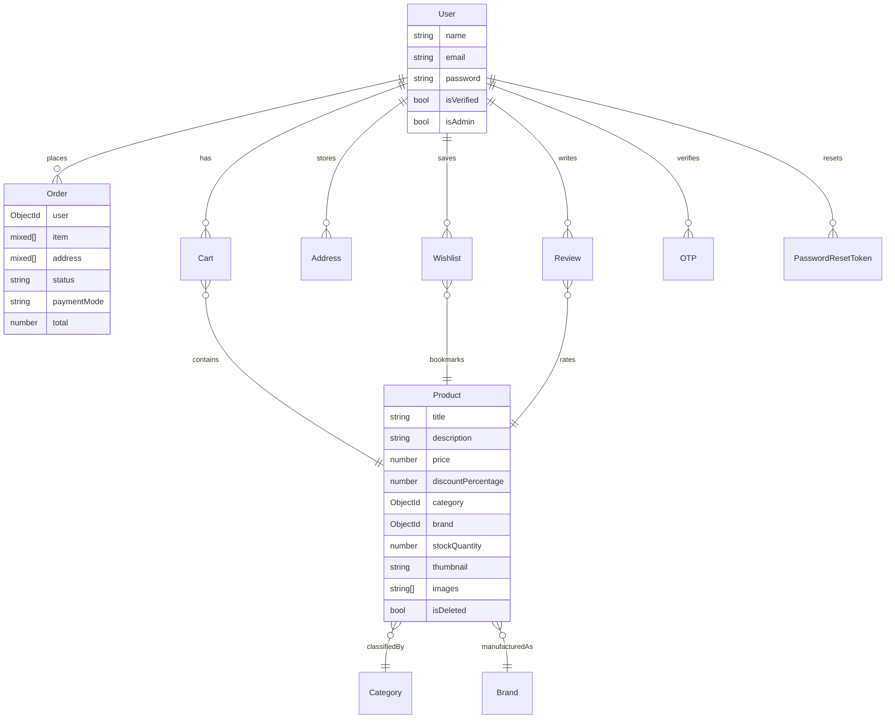
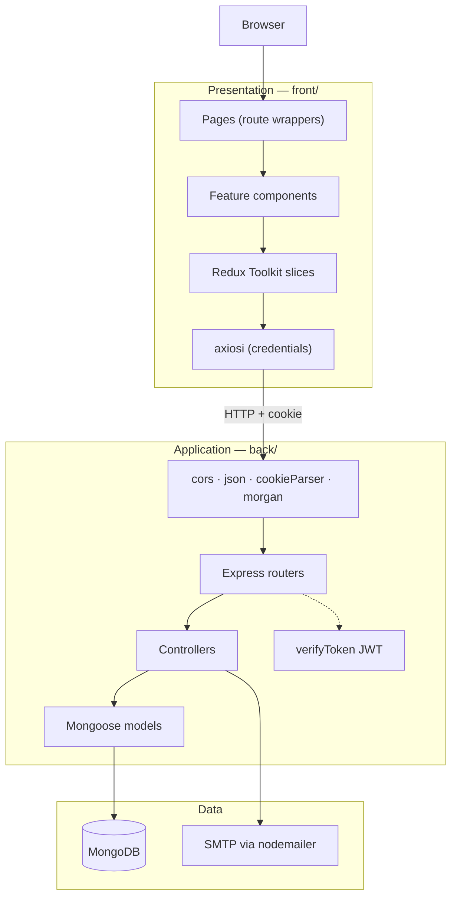
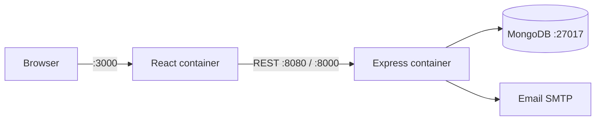
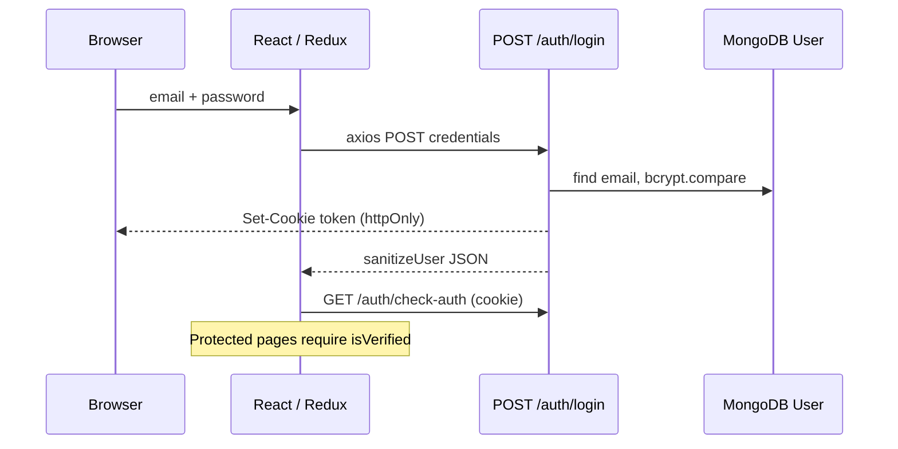
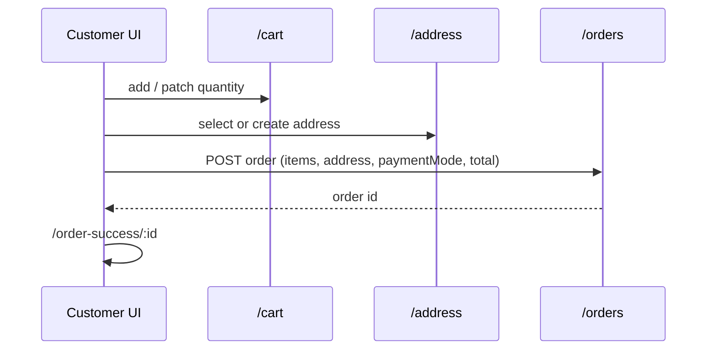
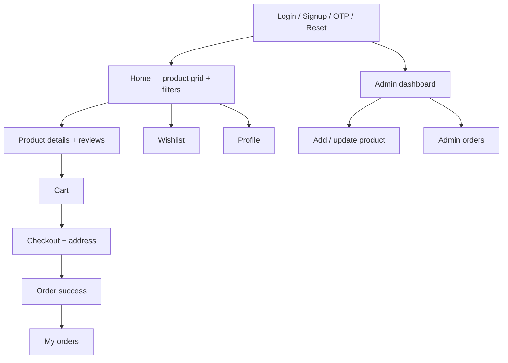

# MedQuick — Software Design Document (DA-2)

**Project:** MedQuick – Medicine & Emergency Essentials Delivery Platform  
**Stack (implemented):** MongoDB · Express.js · React.js · Node.js  
**Code roots used in this document:** `front/` (React) and `back/` (Express)  
**Related docs:** `requirements.md`, `MOSCOW.md`, `user_stories.md`, `vision_document.md`, `readme.md`

| Field | Value |
|---|---|
| Document type | Software Design Document (DA-2) |
| Derived from | Implemented source code, not marketing copy |
| Version | 1.0 |
| Date | 11 September 2026 |

---

# How this document was produced

```
YOUR ACTUAL CODE
       ↓
Design Principles
       ↓
Architecture
       ↓
Requirements → Design Mapping
       ↓
UI Design
       ↓
Design Decisions
       ↓
Scalability
       ↓
Cost Estimation
       ↓
ProjectLibre
       ↓
Software Design Document
       ↓
README + GitHub
       ↓
FINAL DA-2
```

Every section below starts from what exists in the repository. Where `requirements.md` / `to_implement.md` describe healthcare features that **are not in the code yet**, they are marked **Planned**, not **Implemented**.

---

# 0. Actual code baseline

## 0.1 Runtime topology (from `docker-compose.yml` + `back/index.js`)

| Service | Implemented as | Port in code / compose |
|---|---|---|
| React SPA | `front/` (Compose file currently points at `./frontend`) | 3000 |
| Express API | `back/index.js` listens on **8000**; Compose maps **8080** | 8000 / 8080 |
| MongoDB | Mongoose `connect(process.env.MONGO_URI)` | 27017 |

**Repo note:** the workspace contains duplicate trees (`front`/`Frontend`, `back`/`Backend`). This DA-2 treats **`front` + `back`** as the design source.

## 0.2 Backend modules that actually exist

```
back/
  index.js              Express app, CORS, cookie-parser, morgan, route mount
  database/db.js        mongoose.connect(MONGO_URI)
  middleware/VerifyToken.js   JWT from httpOnly cookie
  controllers/          Auth, Product, Order, Cart, Brand, Category, User, Address, Review, Wishlist
  models/               User, Product, Order, Cart, Brand, Category, Address, Review, Wishlist, OTP, PasswordResetToken
  routes/               one router file per resource
  seed/                 seed.js + per-model seed files
  utils/                Emails, GenerateOtp, GenerateToken, SanitizeUser
```

Mounted APIs (`back/index.js`):

| Prefix | Resource |
|---|---|
| `/auth` | signup, login, OTP, password reset, check-auth, logout |
| `/users` | user profile |
| `/products` | CRUD + soft-delete / undelete |
| `/orders` | create, list, by user, status patch |
| `/cart` | cart lines |
| `/brands` | brand catalogue |
| `/categories` | category catalogue |
| `/address` | delivery addresses |
| `/reviews` | ratings and comments |
| `/wishlist` | saved products |

## 0.3 Frontend modules that actually exist

```
front/src/
  app/store.js          Redux Toolkit store (10 slices)
  config/axios.js       axios instance, withCredentials, REACT_APP_BASE_URL
  features/             auth, products, user, brands, categories, cart, address, review, order, wishlist, admin, checkout, navigation, footer
  pages/                one page wrapper per route
  hooks/useAuth/        auth check + fetch logged-in user
  theme/theme.js        MUI theme (Poppins, black / #DB4444)
```

Redux slices (`front/src/app/store.js`): Auth, Product, User, Brand, Categories, Cart, Address, Review, Order, Wishlist.

## 0.4 Routes that actually exist (`front/src/App.js`)

**Public**

- `/signup`, `/login`, `/verify-otp`, `/forgot-password`, `/reset-password/:userId/:passwordResetToken`

**Protected (verified JWT user)**

- Product details `/product-details/:id`
- Logout `/logout`

**Customer (non-admin)**

- `/` home, `/cart`, `/profile`, `/checkout`, `/order-success/:id`, `/orders`, `/wishlist`

**Admin (`loggedInUser.isAdmin`)**

- `/admin/dashboard`, `/admin/add-product`, `/admin/product-update/:id`, `/admin/orders`
- Unknown paths redirect to `/admin/dashboard`

**Not present in `App.js` (documented in `to_implement.md` only)**

- `/admin/prescriptions`

## 0.5 Data model that actually exists



**Implemented enums**

- Order `status`: `Pending` | `Dispatched` | `Out for delivery` | `Cancelled` (`back/models/Order.js`)
- Order `paymentMode`: `COD` | `UPI` | `CARD`

**Not in Product schema yet:** `requiresPrescription`, `manufacturer`, `expiryDate`, `dosage`, `medicineType`.

---

# 1. Design Principles

These principles are inferred from the code, then stated so the rest of DA-2 can justify them.

| Principle | Evidence in code | How we apply it |
|---|---|---|
| **Separation of concerns** | `routes` → `controllers` → `models`; React `pages` wrap `features` | API and UI change independently |
| **Feature-based frontend** | `front/src/features/<domain>/{Api,Slice,components}` | One bounded context per shopping domain |
| **Single source of client state** | Redux Toolkit `configureStore` | Server data and UI flags live in slices, not ad-hoc props |
| **Stateless API + cookie session** | JWT in httpOnly cookie (`Auth.js`, `VerifyToken.js`) | Browser stores no access token in JS |
| **Least privilege (role split)** | `User.isAdmin`; `App.js` builds different route trees | Admin never sees customer cart routes; customer never sees admin CRUD |
| **Defense in depth (auth)** | bcrypt hash on signup; `sanitizeUser` strips password; OTP + reset-token collections | Password never returned; extra step after signup |
| **Soft delete for catalogue** | `Product.isDeleted` + `/products/undelete/:id` | Inventory recoverable without losing references |
| **RESTful resource URLs** | `/products`, `/orders`, `/cart`, … | Predictable HTTP verbs |
| **Configuration over hardcoding** | `dotenv`, CORS `ORIGIN`, axios `REACT_APP_BASE_URL` | Same image, different environments |
| **Container reproducibility** | Docker Compose: mongo + backend + frontend | Identical local stack for the team |
| **Open/Closed for catalogue growth** | Category and Brand as collections, not enums | New healthcare categories without schema migration |
| **Fail closed on auth** | `Protected` redirects to `/login` unless `isVerified` | Unverified users cannot shop |

SOLID mapping (backend):

- **S** — one controller file per resource.
- **O** — new resource = new route/controller/model; `index.js` only mounts.
- **L** — all Mongoose models share the same Express JSON contract.
- **I** — clients call only the resource they need (cart vs wishlist vs orders).
- **D** — controllers depend on Mongoose models, not on React.

---

# 2. Architecture

## 2.1 Style

**Client–server, layered MERN, REST over HTTP, document database.**

Not microservices. One Express process, one React SPA, one MongoDB database. Docker Compose is an **orchestration** of those three processes, not a distributed domain split.

## 2.2 Logical architecture



## 2.3 Physical / deployment architecture (as designed)



Local: Docker Compose network `medquick-network`.  
Production intent (from `vercel.json` in backend folders + README): frontend and API on PaaS (Vercel/Render), data on MongoDB Atlas.

## 2.4 Auth sequence (implemented)



Signup additionally hashes with `bcrypt.hash(..., 10)`, issues JWT, and later uses OTP (`/auth/verify-otp`, `/auth/resend-otp`).

## 2.5 Checkout sequence (implemented)



Payment modes exist on the Order document. There is **no payment-gateway SDK** in `back/package.json` (no Stripe/Razorpay). COD/UPI/CARD are recorded as strings only.

## 2.6 Layer responsibilities

| Layer | Responsibility | Does not do |
|---|---|---|
| Pages | Bind URL → screen | Business rules |
| Feature components | UI + dispatch | Direct Mongo access |
| `*Api.jsx` | HTTP calls | Token parsing |
| Controllers | Validate flow, persist, email | Render HTML |
| Models | Schema + refs | HTTP status codes |
| `VerifyToken` | Prove identity | Role authorization matrix (admin checks are mostly in the SPA) |

**Design implication:** admin protection is **UI-route based** (`isAdmin` in `App.js`). Server product/order routes do not uniformly re-check `isAdmin`. That is recorded as a risk in §5.

---

# 3. Requirements → Design Mapping

Source requirements: `requirements.md` + `MOSCOW.md`. Design = code modules.

## 3.1 Must-have mapping

| Req ID | Requirement | Design element | Status in code |
|---|---|---|---|
| M-01 | Registration | `POST /auth/signup`, `SignupPage` | Implemented |
| M-02 | Login | `POST /auth/login`, JWT cookie, `LoginPage` | Implemented |
| M-03 | Logout | `GET /auth/logout`, `Logout` component | Implemented |
| M-04 | Browse products | `GET /products`, `ProductList` / `HomePage` | Implemented (generic catalogue) |
| M-05 | Search | Product list filters / query on `GET /products` | Implemented (e-commerce search, not Rx-aware) |
| M-06 | Filter by category | `GET /categories` + Product slice filters | Implemented |
| M-07 | Product details | `GET /products/:id`, `ProductDetails` | Implemented; **no dosage / manufacturer / expiry fields** |
| M-08 | Prescription badge | Product schema + `ProductCard` | **Planned** (`to_implement.md`) |
| M-09 | Cart | `/cart` + `CartSlice` + `CartPage` | Implemented |
| M-10 | Checkout / place order | `Checkout` + `POST /orders` | Implemented (no gateway) |
| M-11 | Order tracking | `UserOrders` + order `status` | Implemented with **retail** statuses, not Packed / Confirmed |
| M-12 | Admin product CRUD | Admin dashboard, add/update pages, Product routes | Implemented |
| M-13 | Category management | `/categories` + seed categories | Implemented as name-only documents |
| M-14 | Inventory | `Product.stockQuantity` | Implemented |
| M-15 | Admin order management | `/admin/orders`, `PATCH /orders/:id` | Implemented |

## 3.2 Should-have mapping

| Req ID | Requirement | Design element | Status |
|---|---|---|---|
| S-01 | Profile + addresses | `UserProfilePage`, `/users`, `/address` | Implemented |
| S-02 | Wishlist | `/wishlist`, `WishlistPage` | Implemented |
| S-03 | Order history | `GET /orders/user/:id` | Implemented |
| S-04 | Customer management | User model + admin views | Partial (users exist; dedicated admin customer module is thin) |
| S-05 | Reviews | `/reviews`, `Reviews` / `ReviewItem` | Implemented |
| S-06 | Prescription dashboard | `/admin/prescriptions` | **Not in `App.js`** |

## 3.3 Non-functional → design

| NFR | Design response |
|---|---|
| Security | bcrypt, httpOnly JWT, CORS origin allow-list, sanitizeUser, env secrets |
| Maintainability | Feature folders, REST routers, Docker |
| Usability | MUI + responsive typography in `theme.js` |
| Availability | Compose `restart: unless-stopped`, Mongo volume |
| Performance | Pagination header `X-Total-Count` exposed in CORS; list queries on products |
| Compatibility | CRA browserslist (Chrome / Firefox / Safari / Edge) |

## 3.4 Traceability: user story → code

| Story | Primary files |
|---|---|
| US-01/02/03 Auth | `back/controllers/Auth.js`, `front/src/features/auth/` |
| Profile | `back/controllers/User.js`, `features/user/` |
| Catalogue | `controllers/Product.js`, `features/products/` |
| Cart / checkout | `controllers/Cart.js`, `Order.js`, `features/cart`, `features/checkout` |
| Admin | `features/admin/components/*`, admin routes in `App.js` |

---

# 4. UI Design

## 4.1 Design system (from `theme.js` + MUI)

| Token | Value | Rationale |
|---|---|---|
| Font | Poppins | Clean retail / healthcare readability |
| Primary | `#000000` | High-contrast chrome |
| Accent / dark | `#DB4444` | CTA / alert (currently retail red, not medical teal) |
| Layout | Sticky white `AppBar`, no elevation | Storefront, not dashboard-first |
| Breakpoints | MUI xs–xl plus custom 480 / 662 / 414 typography | Mobile-first type scale |

## 4.2 Information architecture



## 4.3 Screen inventory (implemented pages)

| Screen | File | Role |
|---|---|---|
| Home | `HomePage.jsx` | Browse / filter |
| Product details | `ProductDetailsPage.jsx` | PDP |
| Cart | `CartPage.jsx` | Line items |
| Checkout | `CheckoutPage.jsx` | Address + payment mode + place order |
| Order success | `OrderSuccessPage.jsx` | Confirmation |
| Orders | `UserOrdersPage.jsx` | History / status |
| Wishlist | `WishlistPage.jsx` | Saved items |
| Profile | `UserProfilePage.jsx` | Name + addresses |
| Login / Signup / OTP / Forgot / Reset | auth pages | Identity |
| Admin dashboard | `AdminDashboardPage.jsx` | Catalogue ops |
| Add / update product | `AddProductPage.jsx`, `ProductUpdatePage.jsx` | CRUD forms |
| Admin orders | `AdminOrdersPage.jsx` | Status updates |
| 404 | `NotFoundPage.jsx` | Fallback |

## 4.4 Interaction patterns already in the UI

- **Protected gate:** unverified users → `/login`.
- **Role fork:** entire router tree swaps for admin vs customer (no mixed nav).
- **Badges:** cart and wishlist counts on `Navbar`.
- **Filter drawer:** `TuneIcon` toggles product filters via Redux.
- **Toasts:** `react-toastify`.
- **Motion / empty states:** Framer Motion + Lottie (`loading`, `notFoundPage`, `noOrders`, `orderSuccess`, `shoppingBag`).

## 4.5 UI gaps vs MedQuick branding (honest)

| Spec | Code today |
|---|---|
| Brand name MedQuick | Navbar still renders **“MERN SHOP”** |
| Healthcare banners / Rx badge | Not in `ProductCard` props |
| Medicine fields on PDP / admin forms | Not in Product schema or add-product form |
| Healthcare order statuses | Admin still uses Dispatched / Out for delivery |

These are **UI design remaining work**, not invented as done.

## 4.6 Wireframe-level layout (home)

```
+--------------------------------------------------+
|  MERN SHOP     [Avatar] [♥ n] [Cart n] [Filters] |
+------------------+-------------------------------+
| Category/Brand   | Banner carousel               |
| filters          | Product grid (cards)          |
| price / stock    |  title, price, discount, img  |
+------------------+-------------------------------+
| Footer                                           |
+--------------------------------------------------+
```

---

# 5. Design Decisions

Recorded as ADR-style entries so DA-2 can be defended in viva.

### D1 — Keep a modular monolith (MERN), not microservices

**Context:** Student team, one domain (shop + light healthcare).  
**Decision:** Single Express API + single SPA.  
**Consequences:** Simple Docker Compose; vertical scaling later; no inter-service auth.  
**Rejected:** Separate auth/catalogue/order services (ops cost too high for V1).

### D2 — Feature folders + Redux Toolkit instead of Context-only

**Decision:** One slice + API module per domain.  
**Why:** Cart, wishlist, and auth are cross-page; Context would prop-drill.  
**Trade-off:** Boilerplate (`createAsyncThunk` per endpoint).

### D3 — JWT in httpOnly cookies, not localStorage

**Decision:** `res.cookie('token', …, { httpOnly, sameSite Lax/None, secure in PRODUCTION })`.  
**Why:** Reduces XSS token theft. Axios `withCredentials: true`.  
**Trade-off:** CORS must allow credentials and a fixed `ORIGIN`.

### D4 — Cookie session + `sanitizeUser` instead of returning password hashes

**Decision:** Auth JSON is `_id`, email, `isVerified`, `isAdmin` only.  
**Why:** Least exposure of PII/secrets.

### D5 — MongoDB documents + Mixed snapshots on Order

**Decision:** `Order.item` and `Order.address` are `Schema.Types.Mixed` arrays.  
**Why:** Order must remain historically correct if product price or address changes later.  
**Trade-off:** Weaker schema validation on line items.

### D6 — Soft delete products (`isDeleted`) rather than hard delete

**Why:** Orders and reviews still reference products.  
**API:** `DELETE /products/:id` plus `PATCH /products/undelete/:id`.

### D7 — Role routing in the SPA

**Decision:** `App.js` chooses admin vs customer route set from `loggedInUser.isAdmin`.  
**Why:** Fast UX, fewer accidental admin URLs.  
**Risk:** API-level admin authorization is incomplete; must be hardened before production.

### D8 — Email OTP + password-reset collection

**Decision:** Separate `OTP` and `PasswordResetToken` models, nodemailer.  
**Why:** Signup verification and recovery without a third-party auth vendor.

### D9 — Docker Compose for the team, Atlas/Vercel for cloud

**Decision:** Local mongo + bind mounts for hot reload; README documents Atlas.  
**Why:** Onboarding in three commands; free-tier deploy later.

### D10 — Material UI rather than custom CSS system

**Decision:** `@mui/material` + emotion.  
**Why:** Accessible components, responsive grid, speed of delivery.  
**Trade-off:** Default look is still generic shop; healthcare theme is a follow-up (palette + branding).

### D11 — Duplicate `Frontend`/`Backend` folders

**Observation:** Two copies exist.  
**Decision for DA-2:** Design and Docker **should** converge on one pair (`front`/`back` or `frontend`/`backend`) to match `docker-compose.yml`.  
**Status:** Technical debt, not an intended architecture.

### D12 — Payment recorded, not processed

**Decision:** `paymentMode` enum only. Matches SRS constraint “payment gateway excluded from V1”.

---

# 6. Scalability

## 6.1 What V1 already scales

| Axis | Mechanism |
|---|---|
| Catalogue size | MongoDB collections; Category/Brand not hardcoded |
| Read-heavy listing | Stateless Express replicas behind one DB (possible later) |
| Client complexity | Feature slices can split into packages without rewriting API |
| Environments | Env vars + Compose / Atlas URI swap |
| Images | Product `thumbnail` / `images` are URLs (object storage can replace local URLs) |

## 6.2 Bottlenecks (from this architecture)

1. **Single MongoDB primary** — all cart, order, and product traffic.  
2. **No cache** — product list hits Mongo every request.  
3. **No queue** — emails sent inline in Auth controller (OTP / reset).  
4. **Order Mixed blobs** — harder to aggregate analytics.  
5. **SPA admin checks** — not a scale issue, a **security** issue under more users.

## 6.3 Scale-out plan (without rewriting the domain)

```
Phase 1 (now)     1× React  1× Express  1× Mongo
Phase 2           CDN for SPA + image URLs; Atlas M10; API replicas
Phase 3           Redis cache for GET /products and categories
Phase 4           Extract notification worker (OTP/email)
Phase 5           Optional mobile client against same REST API
```

Horizontal scale of Express is valid because **JWT is self-contained** (no in-memory session store). Sticky sessions are not required.

## 6.4 Data growth

| Collection | Growth driver | Indexing intent |
|---|---|---|
| Product | SKUs | `category`, `brand`, `isDeleted`, text on `title` |
| Order | Checkouts | `user`, `createdAt`, `status` |
| Cart / Wishlist | Active users | `{ user, product }` unique compound |
| Review | PDP traffic | `{ product, user }` |

## 6.5 Future healthcare load (planned, not coded)

Prescription uploads and OCR are **Won't Have**. When added: object storage (S3) + async verification job; do **not** store PDFs inside Mongo documents.

---

# 7. Cost Estimation

Academic V1, 2–3 developers, ~12 weeks, India-region cloud list prices as **order-of-magnitude** (USD, 2026 student/free-tier biased).

## 7.1 Effort (COCOMO II — organic, indicative)

Assume ~8–10 KLOC equivalent (React + Express + seed, excluding `node_modules`).

Organic COCOMO: `PM = 2.4 × (KLOC)^1.05`  
For 9 KLOC: **≈ 24 person-months** if built from zero.  
This project **reuses an e-commerce skeleton**, so applied effort is closer to **3 developers × 2.5 months ≈ 7.5 person-months**.

| Work package | Person-months |
|---|---|
| Requirements / MoSCoW / stories | 0.5 |
| Architecture & UML | 0.4 |
| Auth + email + OTP | 0.8 |
| Catalogue / cart / checkout | 1.5 |
| Admin dashboard | 0.8 |
| MedQuick domain delta (Rx, statuses, seed) | 1.0 |
| Docker + README | 0.4 |
| UI polish + responsive | 0.8 |
| Testing / demo / DA-2 docs | 1.3 |
| **Total (reuse-based)** | **≈ 7.5** |

## 7.2 Recurring cloud cost (V1, light traffic)

| Item | Choice | Monthly (approx.) |
|---|---|---|
| MongoDB Atlas | M0 free / M10 if needed | $0 – $57 |
| API host | Render / Railway starter | $0 – $7 |
| Frontend | Vercel hobby | $0 |
| SMTP | Gmail app password / Mailtrap | $0 |
| Domain + TLS | optional | $0 – $12 |
| Object storage | not used in V1 | $0 |
| **Student demo** | | **$0 – $15** |
| **Small production** | Atlas M10 + paid API | **$70 – $90** |

## 7.3 One-time / tooling

| Item | Cost |
|---|---|
| GitHub | $0 |
| Docker Desktop | $0 (personal) |
| Figma / Draw.io / StarUML | $0 |
| ProjectLibre | $0 |
| MUI / React / Express licenses | MIT / free |

## 7.4 12-month TCO (demo vs small live)

| Scenario | 12-month cloud | People (if costed at ₹40k/PM) |
|---|---|---|
| Course demo | ~$0–180 | 7.5 PM (academic, not billed) |
| Small live shop | ~$840–1080 | Same code; ops extra |

V1 cost strategy: **stay on free tiers** (README constraint) until payment gateway and prescription storage force paid object storage and a mail/SMS vendor.

---

# 8. ProjectLibre — WBS and schedule

Import these WBS items into **ProjectLibre** (Project → New, then add tasks / indent). Suggested duration: **10 weeks**, 3 resources: R1 Frontend, R2 Backend, R3 Docs/DevOps.

## 8.1 Work Breakdown Structure

```
1. MedQuick DA-2 / V1
   1.1 Initiation
       1.1.1 Vision & SRS freeze
       1.1.2 MoSCoW + user stories → GitHub issues
   1.2 Design
       1.2.1 Architecture diagram (Draw.io)
       1.2.2 ER / Class / Use Case (StarUML)
       1.2.3 UI screens & theme
       1.2.4 This SDD
   1.3 Implementation — platform
       1.3.1 Docker Compose + env
       1.3.2 Auth (JWT, OTP, reset)
       1.3.3 Product / category / brand APIs
       1.3.4 Cart, wishlist, address
       1.3.5 Orders + admin status
       1.3.6 Reviews
   1.4 Implementation — MedQuick delta
       1.4.1 Product healthcare fields
       1.4.2 Seed healthcare catalogue
       1.4.3 Rebrand navbar/footer
       1.4.4 Rx badge + PDP fields
       1.4.5 Order status enum update
       1.4.6 Prescription placeholder page
   1.5 Verification
       1.5.1 Seed + manual test script
       1.5.2 Docker demo recording
   1.6 Closure
       1.6.1 README + GitHub board
       1.6.2 DA-2 compilation
```

## 8.2 Gantt (weeks)

| ID | Task | W1 | W2 | W3 | W4 | W5 | W6 | W7 | W8 | W9 | W10 | Owner |
|---|---|---|---|---|---|---|---|---|---|---|---|---|
| 1.1 | Initiation | ██ | | | | | | | | | | All |
| 1.2 | Design / UML / SDD | ██ | ██ | ░ | | | | | | | ██ | R3 |
| 1.3.1 | Docker | | ██ | | | | | | | | | R3 |
| 1.3.2 | Auth | | ██ | ██ | | | | | | | | R2 |
| 1.3.3–1.3.6 | Shop core | | | ██ | ██ | ██ | ██ | | | | | R1+R2 |
| 1.4 | MedQuick delta | | | | | | ██ | ██ | ██ | | | R1+R2 |
| 1.5 | Test / demo | | | | | | | | ██ | ██ | | All |
| 1.6 | DA-2 close | | | | | | | | | ██ | ██ | R3 |

Critical path: **Auth → Catalogue → Cart → Orders → MedQuick delta → Demo**.

## 8.3 Milestones

| Milestone | Week | Evidence |
|---|---|---|
| M0 Architecture signed | 2 | Draw.io + this SDD draft |
| M1 Shop vertical slice | 6 | Login → product → cart → order |
| M2 MedQuick branding + schema | 8 | Rx fields + seed |
| M3 DA-2 freeze | 10 | PDF + GitHub README screenshots |

ProjectLibre: set calendar Standard, 5-day week, link FS dependencies along the critical path above.

---

# 9. Software Design Details

## 9.1 Component design (frontend)

Each feature follows the same internal pattern:

```
features/<name>/
  <Name>Api.jsx      HTTP
  <Name>Slice.jsx    state + thunks
  components/        presentational + container
```

Admin is UI-only (no `AdminSlice`); it reuses Product and Order slices.

## 9.2 Component design (backend)

```
HTTP → router → controller → mongoose model → MongoDB
                 ↘ utils (mail, otp, jwt, sanitize)
                 ↘ middleware (verifyToken) on selected routes
```

## 9.3 Key class-level types (logical)

| Class | Fields (implemented) | Operations |
|---|---|---|
| User | name, email, password, isVerified, isAdmin | signup, login, update |
| Product | title, description, price, discountPercentage, category, brand, stockQuantity, thumbnail, images, isDeleted | CRUD, soft delete |
| Category / Brand | name | list / seed |
| CartLine | user, product, quantity | add, update, remove |
| WishlistLine | user, product, note | add, remove |
| Address | user, street, city, state, phoneNumber, postalCode, country, type | CRUD |
| Review | user, product, rating 1–5, comment | CRUD |
| Order | user, item[], address[], status, paymentMode, total, createdAt | create, list, patch status |
| OTP | (auth helper) | verify / resend |
| PasswordResetToken | (auth helper) | reset |

UML images for submission: `design/diagrams/uml/class-diagram.png`, `er-diagram.png`, `use-case-diagram.png`.

## 9.4 API design summary

| Method | Path | Purpose |
|---|---|---|
| POST | `/auth/signup` | Register + cookie |
| POST | `/auth/login` | Login + cookie |
| POST | `/auth/verify-otp` | Email verification |
| POST | `/auth/resend-otp` | Resend OTP |
| POST | `/auth/forgot-password` | Reset mail |
| POST | `/auth/reset-password` | Set new password |
| GET | `/auth/check-auth` | Session restore (JWT) |
| GET | `/auth/logout` | Clear cookie |
| POST/GET/PATCH/DELETE | `/products` | Catalogue |
| PATCH | `/products/undelete/:id` | Restore |
| POST/GET/PATCH | `/orders` | Checkout & admin status |
| GET | `/orders/user/:id` | Customer history |
| * | `/cart` `/wishlist` `/address` `/reviews` `/brands` `/categories` `/users` | Supporting resources |
| GET | `/` | Health `{ message: running }` |

## 9.5 Security design

| Control | Implementation |
|---|---|
| Password at rest | bcryptjs cost 10 |
| Transport session | JWT (`jsonwebtoken`) |
| Token storage | httpOnly cookie |
| CSRF residual risk | SameSite Lax locally; None+Secure when `PRODUCTION=true` |
| CORS | explicit `ORIGIN`, credentials true |
| PII in responses | `sanitizeUser` |
| Secrets | `.env` / `.env.example`, not committed secrets |

**Open issues to mention in viva:** product mutation routes should call `verifyToken` + `isAdmin`; JWT env name is `SECRET_KEY` in middleware vs `JWT_SECRET` in Compose — align names before deploy.

## 9.6 Error and logging

- Controllers return JSON `{ message }` with 4xx/5xx.
- `morgan("tiny")` access log.
- JWT errors distinguished: expired vs invalid (`VerifyToken.js`).

---

# 10. README + GitHub

## 10.1 README (repository front door)

`readme.md` already contains: overview, personas, stack, Docker quick start, folder structure, GitHub Flow branches, seed, success metrics.

**Align README with this SDD:**

1. Point clone/setup at the folders Compose actually builds (`frontend`/`backend` **or** retarget Compose to `front`/`back`).
2. Replace placeholder `**<Add your GitHub repository link here>**`.
3. Screenshot paths (`images/image-3.png` etc.) should match files that still exist (`design/diagrams/uml/` and `design/diagrams/architeture/`).
4. State honestly: V1 code is a **MERN shop baseline**; MedQuick healthcare fields are the next increment (`to_implement.md`).

## 10.2 GitHub usage (as specified in README)

| Practice | How it supports DA-2 |
|---|---|
| `main` + `feature-suriyan` / `feature-arun` / `feature-sairam` | GitHub Flow evidence |
| Issues from `user_stories.md` | Requirements traceability |
| Kanban: Backlog → To Do → In Progress → Testing → Done | Process mark |
| PRs into `main` | Review evidence |
| `.github/ISSUE_TEMPLATE` | bug_report + feature_request |

## 10.3 Suggested issue labels for remaining MedQuick delta

`auth`, `catalogue`, `cart`, `admin`, `healthcare`, `docker`, `docs`

---

# 11. FINAL DA-2 — compilation checklist

Submit this pack:

1. **This SDD** (`design/DA-2_Software_Design_Document.md` → export PDF).
2. **Architecture PNG + Draw.io** (`design/diagrams/architeture/`).
3. **UML PNGs** (`design/diagrams/uml/`).
4. **SRS / MoSCoW / stories / vision** (repo root).
5. **README + GitHub screenshots** (repo, branches, Kanban).
6. **Docker evidence** (`DOCKER_SETUP.md`, `docker-compose.yml`, Desktop screenshot).
7. **ProjectLibre** file built from §8 WBS (Gantt + WBS views exported to PDF).
8. **Cost sheet** (§7 tables).

### Code vs documents (examiner-safe)

| Claim in older docs | Actual code |
|---|---|
| Healthcare product fields | Not in `Product` schema |
| Order statuses Packed / Confirmed / Delivered | `Pending` / `Dispatched` / `Out for delivery` / `Cancelled` |
| Navbar “MedQuick” | “MERN SHOP” |
| Prescription admin route | Missing |
| Compose `./frontend` `./backend` | Folders `front`/`Frontend`, `back`/`Backend` |
| API port 8080 | `back/index.js` uses **8000** |

DA-2 design is still valid: the **architecture and principles are those of the running MERN system**. Healthcare items are a **scheduled delta** on the same architecture (D1, Open/Closed on Product schema, new admin page), not a new system.

---

# 12. Conclusion

MedQuick DA-2 is designed as a **layered MERN modular monolith**: React feature modules and Redux slices on the client; Express resource controllers and Mongoose models on the server; JWT cookies for session; Docker Compose for local runtime. Requirements M-01–M-07 and M-09–M-15 map onto existing modules. Remaining DA-2 implementation work is a **domain overlay** (schema fields, seed data, branding, statuses, prescription placeholder) that does not change the architectural style.

That overlay is the correct next sprint on the critical path in §8, not a reason to redraw the system as microservices or a mobile-first rewrite.
