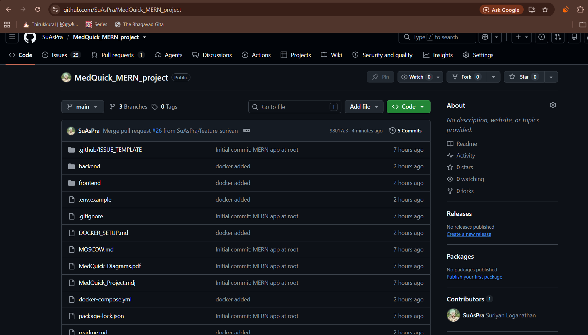
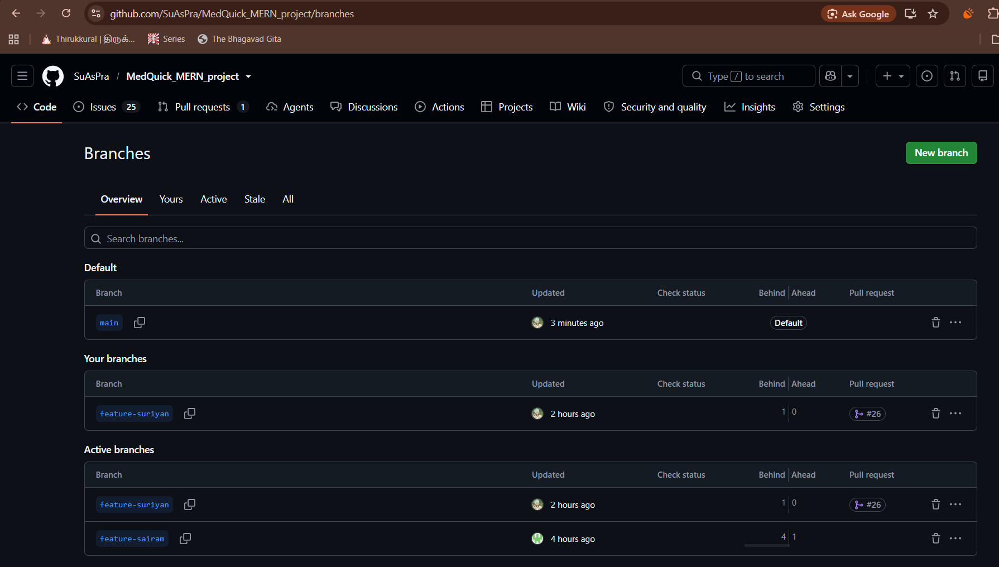
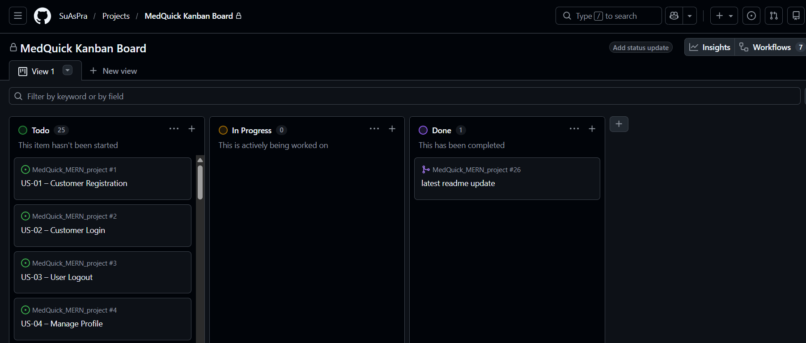
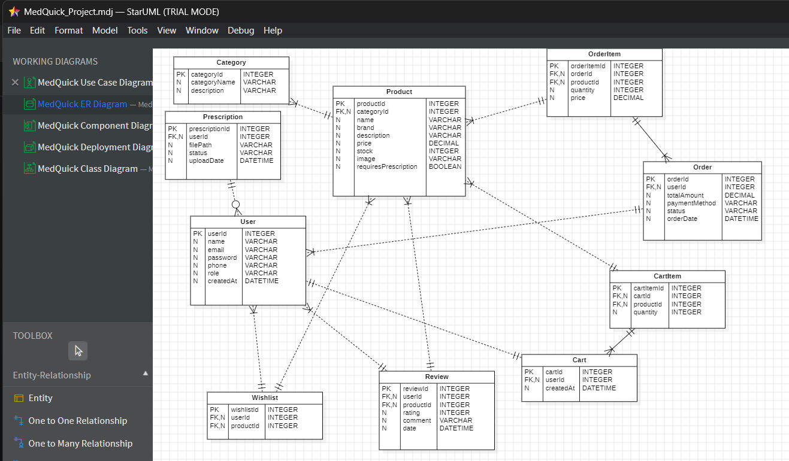
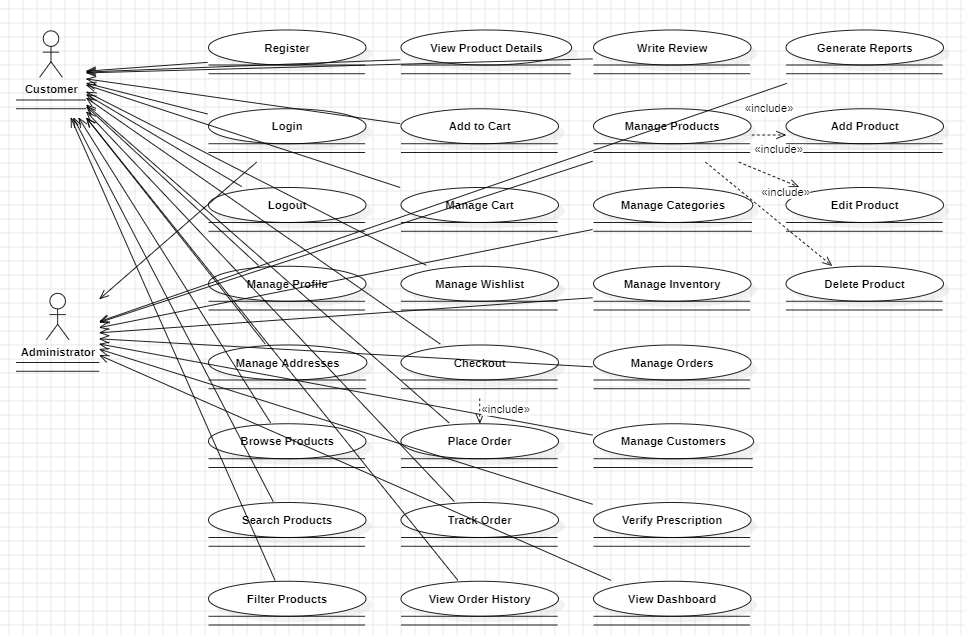
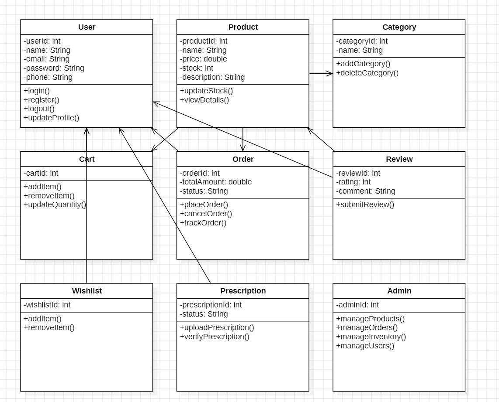
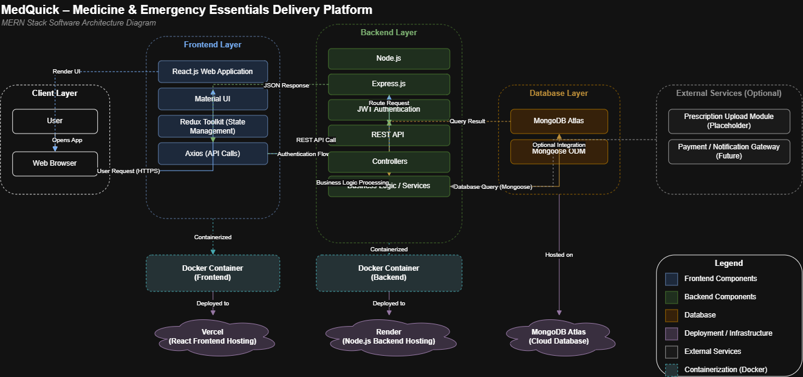
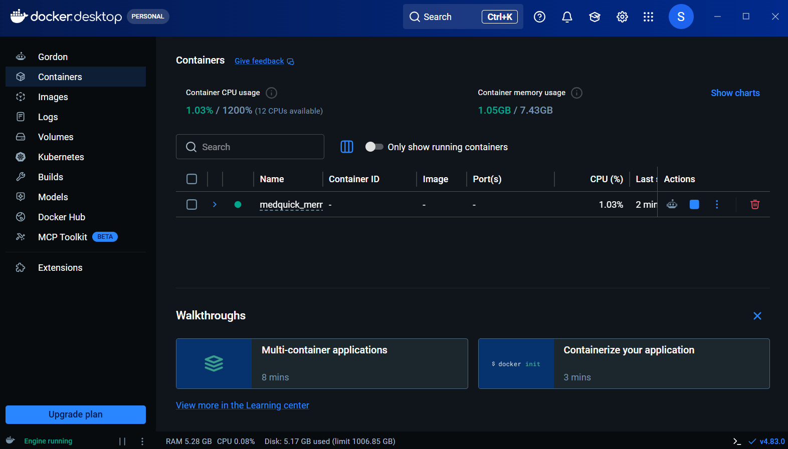
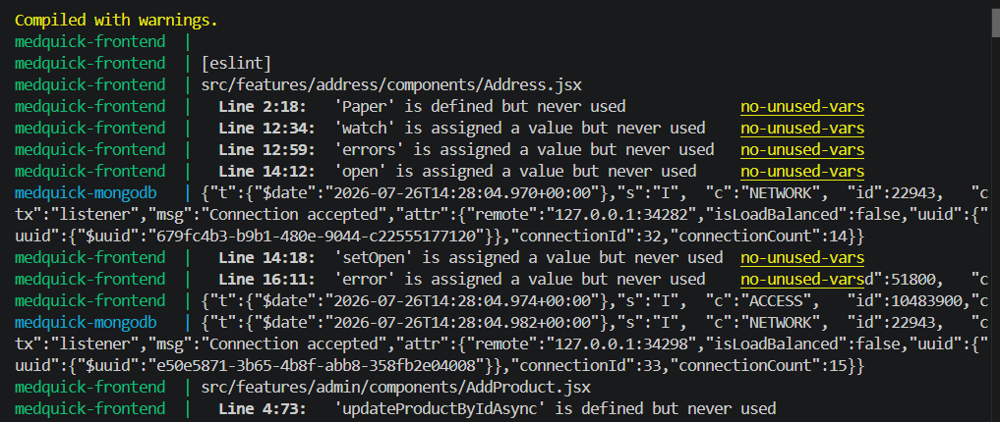
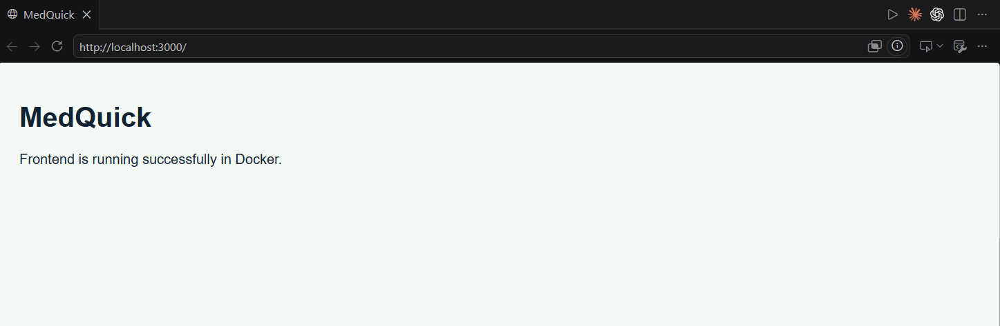

# MedQuick – Medicine & Emergency Essentials Delivery Platform

## Project Overview

MedQuick is a MERN stack web application for purchasing medicines and emergency healthcare essentials online. Customers can browse and search products, manage carts and wishlists, place orders, track order status, manage addresses, and submit reviews. Administrators can manage products, categories, inventory, customers, and orders.

The current V1 is a **modular monolithic application** using a three-tier architecture: **Presentation → Application → Data**.

## Problem Statement

Traditional medicine purchasing can be time-consuming, especially during emergencies. MedQuick provides centralized product discovery, keyword search, category and brand filtering, secure authentication, order placement, tracking, and inventory management.

## Target Users

### Customer
- Register and log in
- Browse, search and filter healthcare products
- View product details and prescription requirements
- Manage cart, wishlist and addresses
- Place and track orders
- View order history
- Submit product reviews

### Administrator
- Manage products and categories
- Manage inventory
- Manage customer records
- Manage customer orders
- View prescription verification information

## Vision Statement

To provide a reliable, accessible, and efficient digital healthcare marketplace that simplifies medicine purchasing while ensuring a seamless experience for customers and administrators.

## Key Features

- User registration and login
- Product browsing, search and filtering
- Product details
- Shopping cart and wishlist
- Address management and checkout
- Order management, history and tracking
- Product reviews
- Prescription-required medicine indicator
- Manufacturer, expiry date, dosage and medicine type
- Admin product, category, inventory, customer and order management
- Prescription verification dashboard placeholder

## Healthcare Categories

1. Medicines
2. First Aid
3. Emergency Supplies
4. Health Devices
5. Personal Care
6. Baby Care
7. Wellness
8. Daily Essentials

## Success Metrics

- Successful user authentication
- Accurate product management
- Smooth cart and checkout flow
- Successful order placement
- Responsive user interface
- Efficient inventory management
- Secure API communication
- Stable application execution

## Assumptions & Constraints

### Assumptions
- Users have internet access.
- MongoDB is available.
- Customers provide accurate account information.
- Prescription verification is a placeholder in the current V1.
- The project is primarily academic and demonstrational.

### Constraints
- MERN stack implementation.
- Docker used for local development.
- Current V1 is a modular monolith.
- OCR, real-time GPS tracking, online payment gateway, Redis and microservices are future enhancements unless separately implemented.

# Technology Stack

### Frontend
- React.js
- Material UI
- Redux Toolkit
- Axios

### Backend
- Node.js
- Express.js
- REST API
- JWT authentication

### Database
- MongoDB
- Mongoose

### Development Tools
- Visual Studio Code
- Git and GitHub
- Docker and Docker Compose
- Postman
- Draw.io / diagrams.net
- Figma
- MongoDB Atlas
- Node.js and npm

# Software Design

MedQuick's software design focuses on abstraction, modularity, high cohesion, low coupling, separation of responsibilities, maintainability and scalability.

## Design Principles Applied

### Abstraction

Frontend API communication is centralized in reusable API modules. A shared Axios client provides a common backend communication interface:

```javascript
export const axiosi = axios.create({
    withCredentials: true,
    baseURL: process.env.REACT_APP_BASE_URL
});
```

### Modularity

The frontend uses feature-based modules such as `auth`, `products`, `cart`, `checkout`, `order`, `admin`, `user`, `address`, `wishlist`, `review`, `brands` and `categories`. The backend separates `controllers`, `models`, `routes`, `middleware`, `database` and `utils`.

### High Cohesion

Modules have focused responsibilities. For example, `ProductSlice` manages product state and operations, the Order controller manages order operations, `VerifyToken` handles token verification, and `SanitizeUser` handles user-data sanitization.

### Low Coupling

The application follows a clear flow:

```text
React UI → Redux → API Module → REST API → Controller → Mongoose → MongoDB
```

This limits direct dependencies between the UI, application logic and database.

## SOLID Principles

- **Single Responsibility:** modules have focused responsibilities.
- **Open/Closed:** feature modules can be extended without restructuring the whole application.
- **Liskov Substitution:** has limited direct relevance because the application does not heavily use inheritance hierarchies.
- **Interface Segregation:** separate API modules and Redux slices avoid large unrelated interfaces.
- **Dependency Inversion:** frontend modules communicate through API abstractions rather than database implementation details.

SOLID principles are applied pragmatically; not every principle is equally applicable to every V1 module.

# High-Level Architecture

MedQuick uses a three-tier architecture with a modular monolithic application structure.

```text
                    MEDQUICK SYSTEM
                           |
             +-------------+-------------+
             |                           |
     PRESENTATION LAYER          APPLICATION LAYER
             |                           |
       React.js UI                Node.js / Express
       Material UI                REST API
       Redux Toolkit              Routes / Middleware
       Axios                      Controllers / Business Logic
                                             |
                                             v
                                     DATA ACCESS LAYER
                                             |
                                         Mongoose
                                             |
                                         MongoDB
```

### Architectural Style

- Three-tier architecture
- Client-server architecture
- RESTful API architecture
- Modular monolithic architecture
- Redux unidirectional data flow

### Rationale

The architecture provides separation of responsibilities, easier maintenance and debugging, independent frontend/backend development, reusable modules and a clear path for future service extraction. A modular monolith is appropriate for V1 because microservices would add unnecessary deployment and operational complexity at this stage.

# Database Design

Major MongoDB/Mongoose models include:

- User
- Product
- Category
- Brand
- Order
- Address
- Cart
- Wishlist
- Review
- OTP
- Password Reset Token

### Healthcare Product Attributes

```text
Product
├── title
├── description
├── price
├── category
├── brand
├── stockQuantity
├── requiresPrescription
├── manufacturer
├── expiryDate
├── dosage
└── medicineType
```

### Order Lifecycle

```text
Pending → Confirmed → Packed → Out for Delivery → Delivered
                                      |
                                  Cancelled
```

# REST API Design

Major resource areas include:

```text
/users
/products
/categories
/brands
/orders
/cart
/wishlist
/reviews
/addresses
```

Backend processing follows:

```text
Request → Route → Middleware → Controller → Mongoose Model → MongoDB
```

# Security Design

MedQuick uses JWT-based authentication and protected routes.

```text
Client → JWT Cookie → VerifyToken Middleware → Authenticated Request → Controller
```

Security design includes JWT authentication, protected routes, admin authorization, cookie-based token handling where configured, user-data sanitization and environment-based configuration. Sensitive credentials should not be committed to GitHub.

# Requirements → Design Traceability

| Requirement / User Story | Design Component | Evidence |
|---|---|---|
| Registration and Login | Authentication module | Architecture / Class Diagram |
| Browse products | Product module | Class / ER Diagram |
| Search products | Product API + Controller | Architecture |
| Category filtering | Category module | ER / Class Diagram |
| Product details | Product module | Class Diagram |
| Prescription indication | Healthcare product attributes | Class / ER Diagram |
| Cart | Cart module | ER / Class Diagram |
| Checkout | Checkout + Address + Order | Sequence Diagram |
| Place order | Order module | Sequence / Class Diagram |
| Track order | Order status lifecycle | Activity / Sequence Diagram |
| Wishlist | Wishlist module | ER / Class Diagram |
| Product reviews | Review module | ER / Class Diagram |
| Admin products | Admin/Product modules | Architecture |
| Inventory | Product stock management | Architecture |
| Admin orders | Order management | Architecture |
| Customer management | User/Admin module | Architecture |
| Prescription verification | Admin dashboard placeholder | UI / Architecture |

# UI Design

The major UI screens are:

1. Home
2. Product Listing
3. Product Details
4. Cart & Checkout
5. Authentication
6. Admin Dashboard

The UI emphasizes simple navigation, clear product information, search and filtering, visible prescription requirements, a clear checkout flow, responsive layouts and separate customer/admin experiences.

### Figma Prototype

`[Figma Prototype – link to be added]`

UI screenshots are maintained in `images/` and `design/ui/`.

# Design Diagrams

The repository maintains editable and exported design diagrams under `design/diagrams/`.

The design set includes:

- Use Case Diagram
- Class Diagram
- ER Diagram
- Activity Diagram
- Sequence Diagram
- Component Diagram
- Deployment Diagram
- High-Level Architecture Diagram

# Maintainability

Maintainability is supported through feature-based frontend organization, separated backend routes/controllers/models/middleware/utilities, centralized API communication, Redux state management, reusable UI components, environment-based configuration, REST API boundaries and Mongoose data abstraction.

# Scalability

The current V1 is a modular monolith.

Future scaling can include:

- Multiple Node.js instances
- Load balancing
- Stateless REST APIs
- MongoDB Atlas replica sets
- Index optimization and sharding when required
- Redis caching
- Message queues and asynchronous processing
- Cloud-based file storage

## Future Microservices

Microservices are **not implemented in V1**. If the system grows, modules could be extracted into services such as:

```text
Authentication Service
Product Service
Inventory Service
Order Service
Notification Service
```

The modular monolith provides a structured starting point for future extraction.

# Future Enhancements

- Prescription upload
- OCR-based prescription processing
- Online payment gateway
- Real-time delivery tracking
- Notification service
- Redis caching
- Mobile application
- Cloud deployment
- Load balancing
- Pharmacy partner integration
- AI-powered product search
- Microservice-based deployment

These are future enhancements and are not claimed as implemented in V1.

# Project Metrics

| Metric | Value |
|---|---:|
| JavaScript / JSX source lines | 8,958 |
| Approximate KLOC | 9 KLOC |
| JavaScript / JSX files | 128 |
| Healthcare categories | 8 |
| Seed healthcare products | 16 |
| Order lifecycle states | 6 |
| Major healthcare product attributes | 5 |
| Architecture | Modular Monolith |
| Architecture layers | 3 |

# Product Metrics

| Metric | Value |
|---|---:|
| Healthcare categories | 8 |
| Seed healthcare products | 16 |
| Order lifecycle stages | 6 |
| Healthcare-specific attributes | 5 |
| Customer feature areas | Auth, Products, Cart, Checkout, Orders, Wishlist, Reviews, Address |
| Major Admin areas | Products, Inventory, Orders, Customers, Prescription Placeholder |

# Quality & Verification

The implementation audit verified:

- Backend verification
- Database seed verification
- Frontend build
- Customer flow
- Admin flow
- Legacy terminology scan

These verification areas were reported as passing during implementation verification. They represent project verification checks and not formal automated-test coverage percentages.

# GitHub Project Management

The project uses GitHub Issues and a GitHub Project Kanban board.

```text
Backlog → To Do → In Progress → Testing → Done
```

User stories are tracked through GitHub Issues and organized through the project board.

# Branching Strategy

The project follows a GitHub Flow-based strategy.

### Branches

- `main` – Stable integration branch
- `feature-sairam` – Development branch for Sairam
- `feature-suriyan` – Development branch for Suriyan

### Workflow

1. Create a feature branch from `main`.
2. Develop the feature.
3. Commit changes.
4. Push the feature branch.
5. Create a Pull Request where applicable.
6. Review changes.
7. Merge into `main`.

# Screenshots and Evidence

## GitHub Repository


## GitHub Branches


## GitHub Project Board


## ER Diagram


## Use Case Diagram


## Class Diagram


## Architecture Diagram


## Docker Desktop


## Docker Build and Run


## Running Web Application


# Docker Support

MedQuick includes Docker configuration for local development with frontend, backend and MongoDB services.

Features include:

- Separate frontend and backend containers
- MongoDB container
- Docker Compose orchestration
- Hot reload during development
- Persistent database volume
- Environment-based configuration

## Run with Docker

```bash
cp .env.example .env
docker-compose up --build
```

Application:

```text
http://localhost:3000
```

Backend API:

```text
http://localhost:8080
```

## Stop Services

```bash
docker-compose down
```

To remove containers and volumes:

```bash
docker-compose down -v
```

For detailed Docker documentation, see [DOCKER_SETUP.md](./DOCKER_SETUP.md).

# Quick Start – Local Development

## Prerequisites

- Git
- Docker Desktop
- Node.js 18+ (optional when using Docker)
- npm
- MongoDB / MongoDB Atlas

## Clone Repository

```bash
git clone https://github.com/SuAsPra/MedQuick_MERN_project.git
cd MedQuick_MERN_project
```

## Docker Setup

```bash
cp .env.example .env
docker-compose up --build
```

Open `http://localhost:3000`.

# Alternative: Local Development Without Docker

### Backend

```bash
cd back
npm install
npm run dev
```

### Frontend

In another terminal:

```bash
cd front
npm install
npm start
```

# Database Seeding

With Docker:

```bash
docker-compose exec backend npm run seed
```

Without Docker, run the project's seed command from the backend setup.

# Useful Docker Commands

| Command | Purpose |
|---|---|
| `docker-compose up -d` | Start services in background |
| `docker-compose up --build` | Build and start services |
| `docker-compose ps` | List running containers |
| `docker-compose logs -f` | View real-time logs |
| `docker-compose logs -f backend` | View backend logs |
| `docker-compose stop` | Stop services |
| `docker-compose down` | Stop and remove containers |
| `docker-compose down -v` | Stop containers and remove volumes |
| `docker-compose exec backend sh` | Open backend container shell |

# Environment Configuration

Environment variables are configured using `.env`. A template is provided in `.env.example`. Sensitive credentials should not be committed to GitHub.

# Repository Structure

```text
MedQuick_MERN_project/
│
├── front/                     # React frontend
│   ├── public/
│   ├── src/
│   │   ├── features/
│   │   ├── components/
│   │   └── app/
│   └── package.json
│
├── back/                      # Node.js / Express backend
│   ├── controllers/
│   ├── models/
│   ├── routes/
│   ├── middleware/
│   ├── database/
│   ├── utils/
│   └── index.js
│
├── design/
│   ├── diagrams/
│   │   ├── architeture/
│   │   └── uml/
│   ├── estimation/
│   ├── readme/
│   └── ui/
│
├── images/
├── docker-compose.yml
├── DOCKER_SETUP.md
├── .env.example
├── requirements.md
├── user_stories.md
├── MOSCOW.md
├── vision_document.md
└── README.md
```

# Project Documentation

- [Requirements](requirements.md)
- [User Stories](user_stories.md)
- [MoSCoW Prioritization](MOSCOW.md)
- [Vision Document](vision_document.md)
- [Docker Setup](DOCKER_SETUP.md)
- [Software Design](design/README.md)

# Repository

[MedQuick_MERN_project](https://github.com/SuAsPra/MedQuick_MERN_project)

# Contributors

- **Sairam**
- **Suriyan**

# Project Status

**V1 Development / Academic Project**

The current version focuses on the core medicine and emergency essentials delivery workflow. Advanced capabilities such as OCR prescription processing, real-time GPS tracking, online payment gateway integration, Redis, microservices and large-scale cloud deployment are future enhancements.

# License

This project is developed for academic and educational purposes.
